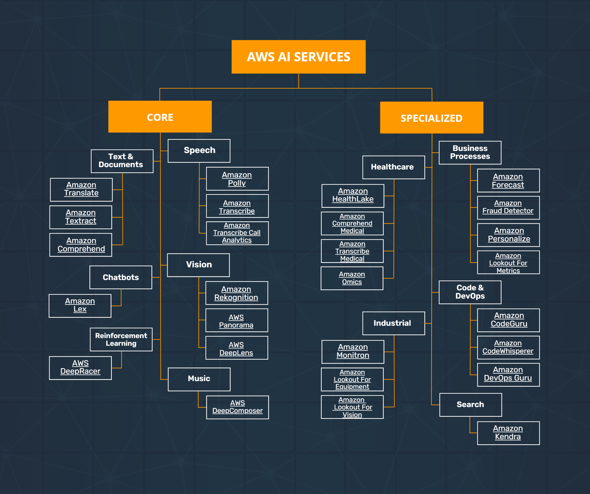

# AWS AI Services

AWS AI Services are broadly categorized into **Core** and **Specialized** services, each serving different aspects of artificial intelligence and machine learning needs.

## Core Services

### Text & Documents
- **Amazon Translate**: This service uses advanced machine learning models to provide fast and accurate language translation, supporting various languages and dialects.

- **Amazon Textract**: It goes beyond simple OCR to also identify the contents of fields in forms and information stored in tables, making it ideal for processing a variety of documents.

- **Amazon Comprehend**: Leveraging machine learning, this service finds insights and relationships in text. It can detect sentiment, entities, key phrases, languages, and more.

### Speech
- **Amazon Polly**: Converts text to lifelike speech using deep learning. It allows you to create applications that talk and build entirely new categories of speech-enabled products.

- **Amazon Transcribe**: Provides transcription services for your audio files, utilizing advanced deep learning technologies to add speech-to-text capability to applications.

- **Amazon Transcribe Call Analytics**: Tailored for call center analytics, it provides insights by analyzing telephony audio to understand customer-agent interactions.

### Vision
- **Amazon Rekognition**: Offers image and video analysis, capable of identifying objects, people, and scenes. It's used in various applications, such as security and user verification.

- **AWS Panorama**: Enables organizations to bring computer vision to on-premises cameras to make automated predictions with high accuracy based on visual data.

- **AWS DeepLens**: A deep learning-enabled video camera, designed for developers to experiment with machine learning models dealing with image recognition.

### Chatbots
- **Amazon Lex**: Provides an easy-to-use console to guide you through the process of creating your own chatbot in minutes, building conversational interfaces.

### Reinforcement Learning
- **AWS DeepRacer**: An autonomous racing car toy for developers to test reinforcement learning models by racing the car on a physical track.

### Music
- **AWS DeepComposer**: A creative tool that introduces developers to the field of machine learning through music generation.

## Specialized Services

### Healthcare
- **Amazon HealthLake**: Enables healthcare organizations to store, transform, and analyze health data at scale.

- **Amazon Comprehend Medical**: Extracts relevant medical information from unstructured text, including conditions, treatments, and dosages.

- **Amazon Transcribe Medical**: Designed to convert speech to text specifically for healthcare professionals, easing the documentation process.

- **Amazon Omics**: A service that supports the management, analysis, and visualization of large volumes of genomics and other omics data.

### Industrial
- **Amazon Monitron**: Simplifies the process of monitoring equipment and predicting when maintenance should be performed.

- **Amazon Lookout for Equipment**: Analyzes the data from industrial equipment, making it possible to predict when machines will need maintenance.

- **Amazon Lookout for Vision**: Uses machine learning models to detect abnormalities in manufacturing processes through visual inspection.

### Business Processes
- **Amazon Forecast**: Uses machine learning to generate more accurate demand forecasting, based on historical data and additional variables.

- **Amazon Fraud Detector**: Detects potentially fraudulent online activities, such as online payment fraud and fake account creations.

- **Amazon Personalize**: Allows developers to build applications with the same machine learning technology used by Amazon.com for real-time personalized recommendations.

- **Amazon Lookout for Metrics**: Finds and diagnoses anomalies in your business metrics, using the same technology used at Amazon.

### Code & DevOps
- **Amazon CodeGuru**: An automated code review service that uses machine learning to identify critical issues, security vulnerabilities, and hard-to-find bugs during application development.

- **Amazon CodeWhisperer**: Helps developers write code faster by providing suggestions, including how to use AWS services.

- **Amazon DevOps Guru**: An ML-powered cloud service that helps you understand and improve your application's operational performance.

### Search
- **Amazon Kendra**: An enterprise search service that uses natural language processing to allow users to more easily find the information they need within their corporate data.
