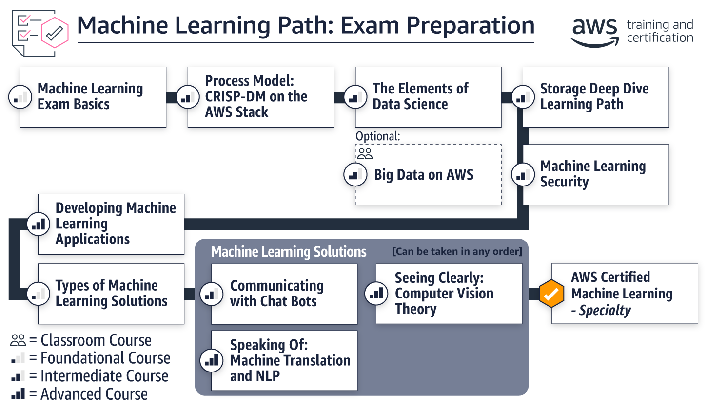

# AWS ML Specialization Certification Preparation

Welcome to the AWS-ML-Specialization-Certification-Preparation repository! This space is dedicated to my journey towards mastering the materials and earning the AWS Machine Learning Specialization Certification. It's a live documentary of the learning process, challenges, and triumphs along the way.

## What You'll Find Here

- **Study Notes**: A collection of personal study notes that distill complex concepts into digestible summaries. These notes cover key topics from AWS's vast suite of ML services and concepts.

- **White Papers**: A curated selection of AWS white papers that offer deep dives into specialized ML topics, architectural best practices, and security protocols within the AWS ecosystem.

- **Course Guides**: Organized references to courses, both AWS-official and third-party, that have been instrumental in building a solid foundation in AWS ML concepts.

- **Resource Compendium**: Links to a variety of resources such as tutorials, documentation, and insightful blog posts that have been pivotal in understanding and applying AWS ML services.

- **Personal Reflections**: Insightful reflections on the learning process, including what worked, what didn't, and how various approaches to learning helped solidify the knowledge required for the certification.

- **Exam Preparation Tips**: Tried-and-tested strategies for approaching the certification exam, including how to manage time during the test, question interpretation techniques, and effective revision practices.

- **Interactive Labs**: Documentation of hands-on labs and experiments with AWS services that provide a practical understanding of theoretical concepts.

## The Journey

This repository isn't just a static collection of resources; it's a living narrative of my educational path. It aims to provide transparency in the learning process, sharing not just the "what" but also the "how" of preparing for the AWS ML Specialization Certification.

## Collaboration

I believe that learning is amplified through community interaction. I welcome suggestions, discussions, and contributions from fellow AWS learners and enthusiasts. If you have resources, wisdom, or experiences to share, please feel free to contribute to this repository.

## Navigating the Repository

The content is organized to facilitate easy navigation, whether you're looking for specific topic information or a structured study plan. Dive into individual directories for focused content, or peruse the README files for guided learning paths.

## License

This repository is shared with the community under the MIT license. Feel free to use the material for your own preparation, and I encourage you to contribute back to help it grow!

---

Embark on this learning adventure with me, and let's conquer the AWS ML Specialization Certification together!
